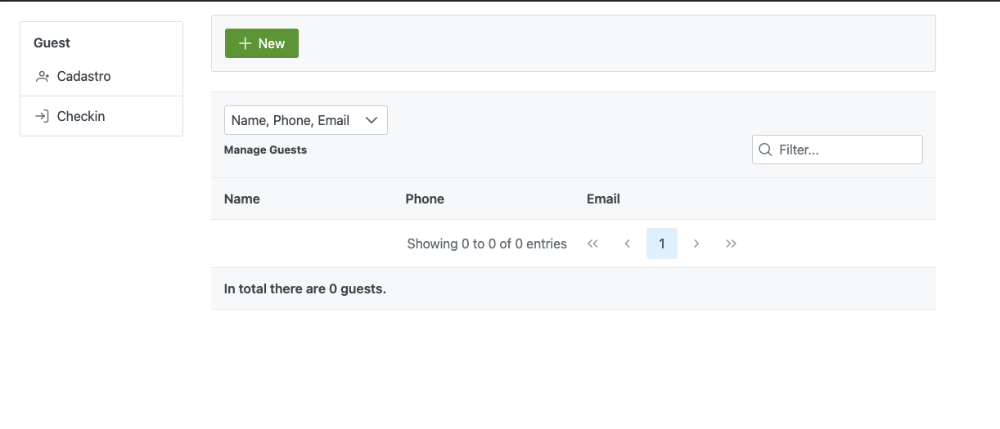
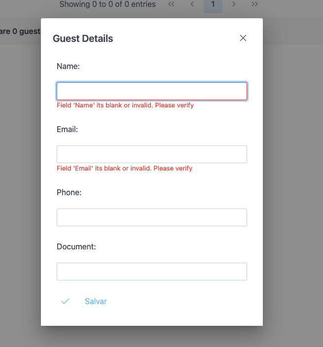
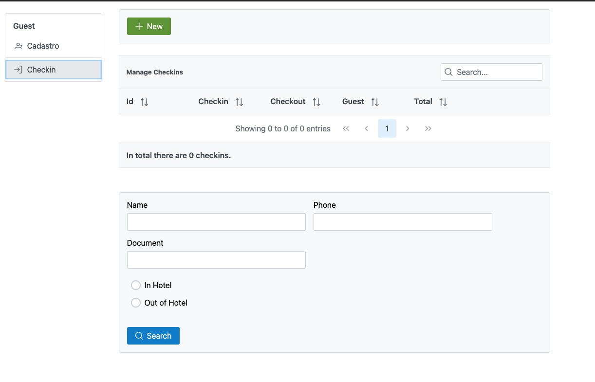
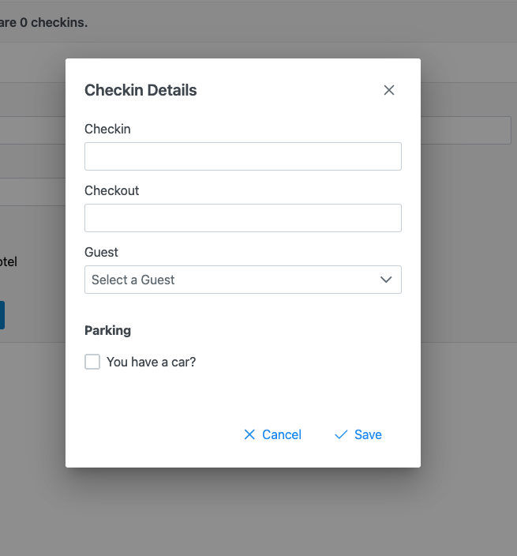

# Sobre o Projeto

## Tecnologias
Foi utilizado para desenvolver a aplicação, Angular 11 no front-end da aplicação e no back-end Java 11 com Spring Boot.

## Pré-Requisitos e Iniciando a Aplicação
### Antes de tudo
Para rodar a aplciação necessita-se previamente instalado o Docker e Docker-Compose
### Rodando a aplicação
Após instalados basta baixaro o arquivo [compose.yml](https://github.com/Erivelto47/form-challenge-angular-java/blob/master/docker-compose.yml) ir ao terminal e rodar o seguinte comando:

`docker-compose up`

Com a aplicação rodando acesse:

`http://localhost:4200`

## Sobre a solução
Nesta aplicação temos o controle de hóspedes de um hotel.

Dentre os recursos estão
1. Cadastro e listagens de hóspedes
2. Cadastro e Listagens de checkins feitos no hotel
3. Valor total pago pelo hóspede durante a estadia
4. Filtro por hóspedes presentes/não presentes no hotel
5. Filtro de hóspedes por nome, documento ou telefone

### As telas são intuitivas e simples

#### Tela de cadastro e listagen de Hóspedes

Para cadastrar um novo hóspede basta adicionar as informações necessárias

#### Tela de cadastro e listagen de Checkins

Para inserir um checkin basta adiconar as dastas, de entrada e saída e qual hóspede do hotel.
Ainda é possível adicionar se ele presará de uma vaga de garagem.

